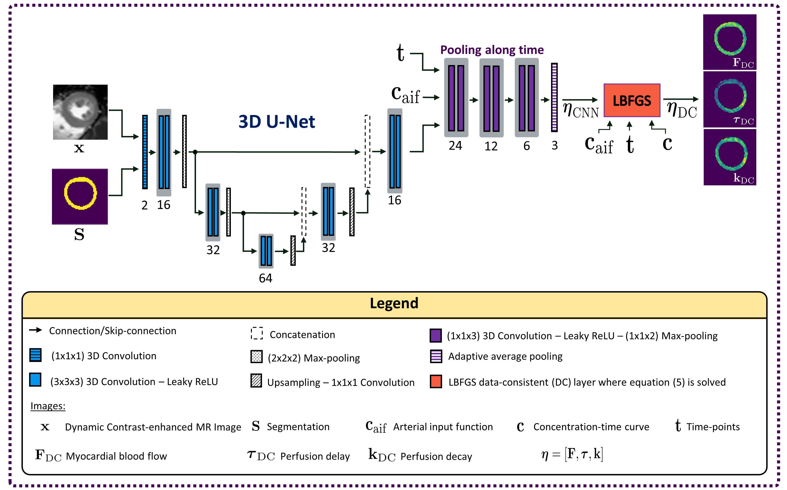
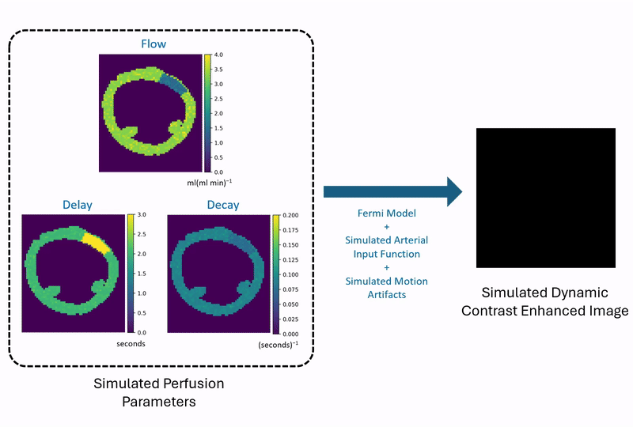

# DeepFermi
A self-supervised deep learning framework that integrates the Fermi model for fast, accurate, robust, and data-consistent myocardial quantification. For more detailed information, please refer to our publication, 'Robust Myocardial Perfusion MRI Quantification with DeepFermi,' which outlines the methodology and validation of the DeepFermi framework. A brief overview is provided in the video below.

https://github.com/user-attachments/assets/5ce65f85-c079-4509-a272-abc54efefe5a

<a id="publication"></a>
| [Publication](https://ieeexplore.ieee.org/document/10731565) | [Citation](#bibtex-citation) |

**Contribution**: Sherine Brahma, Andreas Kofler, Felix F. Zimmermann, Tobias Schaeffter, Amedeo Chiribiri, and Christoph Kolbitsch.

## Network Architecture

<div align="center">
  
</div>

# Installation

### 1. Clone the repository
Clone the repository and create a new Python environment with Python 3.8 (e.g. using conda):
```bash
git clone https://github.com/SherineBrahma/krad-snr.git
conda create -n krad-snr python=3.8
conda activate krad-snr
```

### 2. Install DeepFermi and dependencies
Install DeepFermi in editable mode along with necessary tools for linting, testing. Run the post-install setup to configure the environment for testing and training:
```bash 
pip install -e ".[lint,test]"
sh post_install/post_install.sh
```

# Usage

## 1. Simulate DCE Perfusion Data

This repository includes a small dataset of five cardiac slices based on the [XCAT](https://aapm.onlinelibrary.wiley.com/doi/10.1118/1.3480985) phantom, for the purpose of code demonstration. Run the ```data_generation.py``` script to generate myocardial perfusion maps, and to simulate dynamic contrast agent (DCE) MRI images. Furthermore, you can customize the parameters directly in the data_generation.py script.

```python
python src/deepfermi/data_generation.py
```

A DCE perfusion dataset, ```dce_perfusion_data.npz```, is created in the ```data``` folder. The DCE images that are synthesized are further induced with motion outliers to model practical scenarios, as shown in the gif below.

<div align="center">
  
</div>

## 2. Pre-Trained Model

A pre-trained model, trained on a larger dataset (see [publication](#publication) for details), is included for quick testing. You can directly run the provided testing script to evaluate the pre-trained model on two datasets: i) with motion artifacts, and ii) without motion artifacts.

```python
sh script/test_job_queue.sh
```

The results will be saved as output arrays in the ```experiments``` folder, which can be further assessed. For example, to visualize the generated arrays, run:

```python
 python src/deepfermi/analysis/generate_img.py
```

The example below shows that DeepFermi estimates are more robust to motion artifacts compared to traditional Fermi-deconvolution, which relies on well-established optimization algorithms without deep learning components, such as the [Limited memory Broyden-Fletcher-Goldfarb-Shanno](https://link.springer.com/article/10.1007/BF01589116) (LBFGS) algorithm.

<div align="center">
  
</div>  

You can also write custom scripts to analyze the arrays. Additionally, an ```evaluate_measures.py script``` is provided for quantitatively assessing the performance of the model.

## 3. Train DeepFermi from Scratch

The training pipeline of DeepFermi initially uses LBFGS perfusion estimates as training labels for supervised pre-training, which helps speed up and enhance training convergence. This is followed by a robust self-supervised training methodology ( see [publication](#publication) for details) that requires no ground-truth labels, where the widely used [Fermi](https://aapm.onlinelibrary.wiley.com/doi/10.1118/1.598163) model is utilized to ensure data-consistency. The complete pipeline can be run using the following script:

```python
sh script/train_job_queue.sh
```

After training the model, it can be tested as described for the pre-trained model, with appropriate adaptations to the script and config files. However, keep in mind that the training data provided in this repository is small and intended mainly for code demonstration purposes, so the model's performance will not be optimal.

# Contribution

### How to Contribute
1. Fork the repo and create a new branch.
2. Make changes and test them locally.
3. Submit a pull request with your changes.

### Pre-commit Hooks (Optional)
To automatically run linting before each commit, run:

```
pip install pre-commit
pre-commit install
```

### Running Tests
Run tests before submitting a pull request:
```
pytest  
```

### Issues and Feedback
If you encounter any issues or have suggestions, feel free to open an issue on GitHub.

# Citation

<a id="bibtex-citation"></a>

If you found our work useful, please consider citing it. The BibTeX is provided below:

```bibtex
@article{brahma2024robust,
  title={Robust Myocardial Perfusion MRI Quantification with DeepFermi},
  author={Brahma, Sherine and Kofler, Andreas and Zimmermann, Felix F and Schaeffter, Tobias and Chiribiri, Amedeo and Kolbitsch, Christoph},
  journal={IEEE Transactions on Biomedical Engineering},
  year={2024},
  publisher={IEEE}
}
```