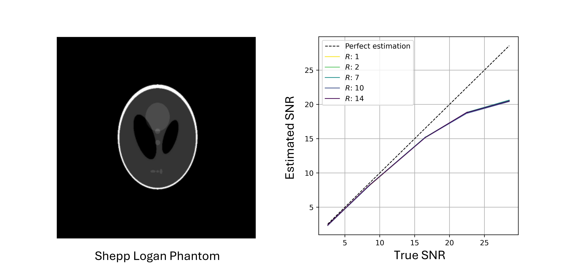

# SNR in Radial Multi-Coil MRI
This repository provides a method for estimating SNR directly from k-space data in radial multi-coil MRI. Unlike conventional image-domain methods, it is independent of reconstruction algorithms and unaffected by inhomogeneous noise distribution across the MRI image due to multicoil reconstruction. It is less sensitive to undersampling factors, providing more reliable SNR estimation, which is useful for tasks such as generating realistic noise levels in simulated k-space datasets and evaluating pulse sequences, RF coils, and MR systems across different field strengths. A brief overview is provided in the video below.

https://github.com/user-attachments/assets/829885ef-0619-4d6d-bbd7-74af3e20fd57

<a id="publication"></a>
| [arXiv](https://ieeexplore.ieee.org/document/10731565) | [citation](#bibtex-citation) |

**Contribution**: Sherine Brahma, Christoph Kolbitsch, and Tobias Schaeffter.

# Installation

### 1. Clone the repository
Clone the repository and create a new Python environment with Python 3.8 (e.g. using conda):
```bash
git clone https://github.com/SherineBrahma/krad-snr.git
conda create -n krad-snr python=3.8
conda activate krad-snr
```

### 2. Install KRadSNR and dependencies
Install KRadSNR in editable mode along with necessary tools for linting, testing. 
```bash 
pip install -e ".[lint,test]"
```

# Usage

## 1. Simulation

The simulation demonstrates the SNR estimation method using a Shepp-Logan phantom. Radial k-space spokes are generated using the NUFFT operator from the TorchKbNufft package, applying a golden-angle acquisition scheme with 32 dummy coil sensitivity maps and varying undersampling factors. Gaussian noise with different standard deviations is then added to the k-space data to evaluate the proposed method under various simulated SNR levels. Configuration inputs for the simulation are defined in the config files located in the config folder. An explanation of these inputs is provided below:

```yaml 
# General Parameters
nr: 320                # Number of readout points per frame
nt: 3                  # Number of temporal frames
osmpl_fact: 2          # Oversampling factor
nspokes_array: [503, 251, 75, 50, 36]  # List of total radial spokes to be simulated
noise_std_list: [1.0, 0.8, 0.5, 0.2, 0.1, 0.05]  # Noise standard deviations
nbootstrap: 100        # Number of bootstrap repetitions for SNR estimation
device: 'cuda'         # Computation device ('cuda' or 'cpu')
```

To run the simulation, execute the following command:

```python
python src/krad-snr/main.py
```

After running the experiment, a folder named ```results``` is created and the simulation results are stored here. An example of a plot for the Shepp-Logan phantom is shown below, with the phantom on the left and the corresponding SNR estimation plot on the right.

<div align="center">
  
</div>

## 2. Custom Data

The `krad_snr()` function calculates signal and noise power directly from radial k-space data and estimates the SNR in decibels for each temporal frame. It includes a compensation step to mitigate the influence of noise in the central region that may affect the signal power calculation.

### **Input Format**

- `kdata` (`torch.Tensor`): Radial k-space data with shape `(1, 2, ncoils, nspokes, nr, nt)`  
  - `1`: Batch size (fixed)
  - `2`: Complex dimension (real and imaginary)  
  - `ncoils`: Number of coils  
  - `nspokes`: Number of radial spokes  
  - `nr`: Number of readout points  
  - `nt`: Number of temporal frames  

- `ktraj` (`torch.Tensor`): Radial k-space trajectory with shape `(1, 2, nspokes, nr)`

- `noise_mean` (`float`): Mean of Gaussian noise (default: `0.0`)

- `npcom` (`int`, optional): Number of simulations for compensation term estimation (default: `100`)

---

### **Output Format**

- `snr` (`torch.Tensor`): Estimated SNR values in decibels, shape `(nt,)`  
- `ksignal_power` (`torch.Tensor`): Estimated signal power, shape `(nt,)`  
- `knoise_power` (`torch.Tensor`): Estimated noise power, shape `(nt,)`  

---

### **Example Usage**

To run the SNR estimation using custom data:

```python
import torch
from main import krad_snr

# Example input data
ncoils, nspokes, nr, nt = 32, 100, 320, 3
kdata = torch.randn(1, 2, ncoils, nspokes, nr, nt)
ktraj = torch.randn(1, 2, nspokes, nr)

# Run SNR estimation
snr, ksignal_power, knoise_power = krad_snr(kdata, ktraj)
```

# Citation

<a id="bibtex-citation"></a>

If you found our work useful, please consider citing it. The BibTeX is provided below:

```bibtex
@article{brahma2024krad,
  title={Determining Signal-to-Noise Ratio in k-space for radial MRI using multichannel receive coils},
  author={Brahma, Sherine and Kolbitsch, Christoph and Schaeffter, Tobias},
  journal={arXiv preprint},
  year={2025}
}
```
